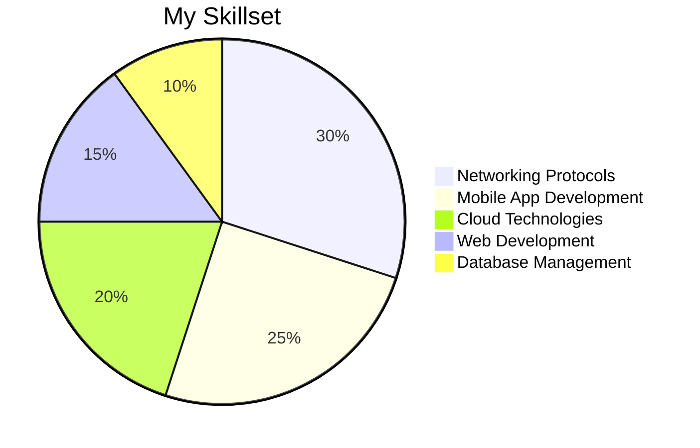
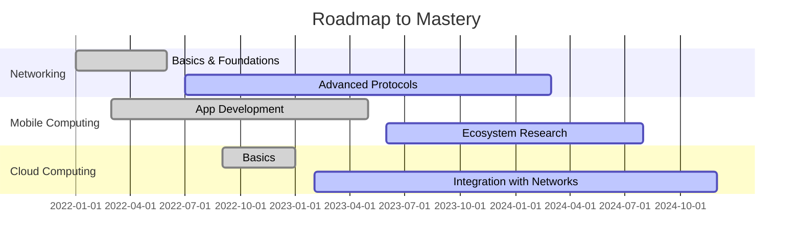

Here's an enhanced and modernized version of your `README.md`, complete with animations, charts, and a creative layout using markdown:

---

# Hello, World! 👋  
I’m **Amaya Wickramaarachchi**, an enthusiastic undergraduate pursuing a **Bachelor's in Information Technology (BIT Hons)** with a focus on **Networking and Mobile Computing**. 🌟  

---

## 🚀 About Me  
✨ Passionate about the **art of connectivity**, I thrive on exploring the depths of networking and mobile technologies.  

🌐 **Networking Enthusiast**  
- Probing into networking protocols.  
- Ensuring seamless digital communication.  

📱 **Mobile Computing Aficionado**  
- Enthralled by the evolving mobile ecosystem.  
- Innovating solutions for the future.  

---

## 🛠️ Tech Stack  

💡 I love creating projects that solve real-world problems and push the boundaries of technology.

---

## 📈 My Journey So Far  

---

## 🌟 Let’s Connect  
📫 Feel free to reach out to me for:  
- Collaborations 🤝  
- Networking chats 🌐  
- Tech discussions 💡  

  
  

---

## 🎨 Fun with Animations  

  

  

✨ _"Happy coding!"_ 💻  

--- 

Feel free to copy this `README.md` into your repository, and let me know if you'd like further adjustments!
