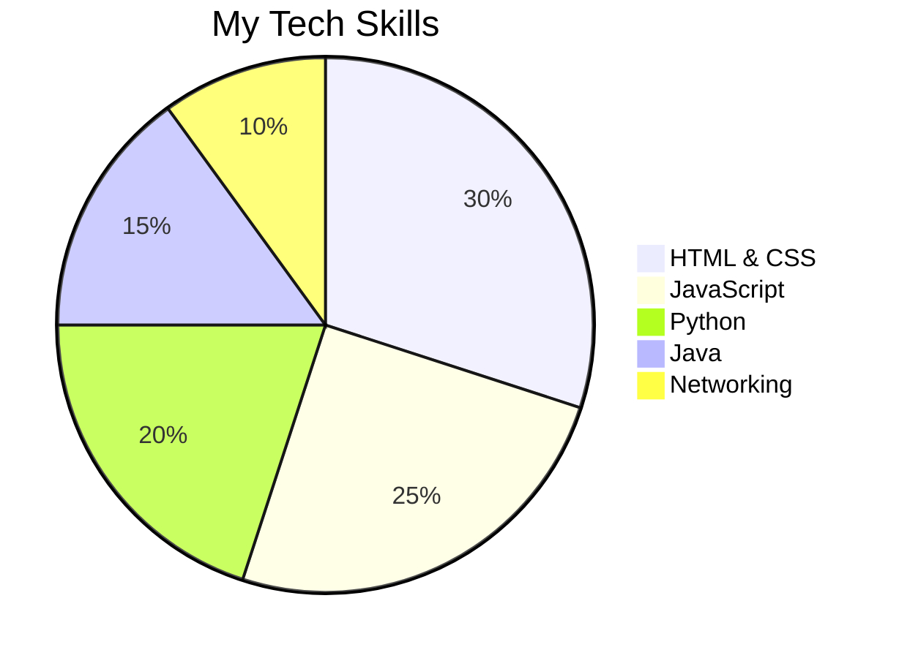
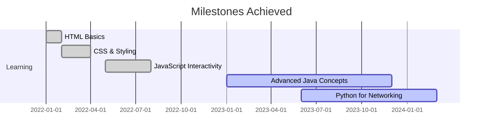

# Hello, World! 👋  

  <h5>
    
  </h5>

---

## 🚀 About Me  

✨ **Passionate Explorer:** Networking protocols, mobile ecosystems, and the art of seamless communication.  
🌐 **Networking Nerd:** Obsessed with optimizing connectivity and solving real-world digital challenges.  
📱 **Mobile Maven:** Enthusiastic about building and understanding mobile-first solutions.  
💡 **Lifelong Learner:** Always curious and eager to learn new technologies and skills.  

---

## 🛠️ Tech Stack  

Here's what I work with:  

  
  
  
  
  

  

---

## 📈 My Journey  

---

## 🎨 Fun with Animations  

  

---

## 🌟 Let’s Connect  

📫 Feel free to reach out for:  
- Networking advice 🌐  
- Collaborations 🤝  
- Tech discussions 💡  

    
    

  

---

**✨ _"Empowered by curiosity, driven by code."_**  

---

### Notes:  
- Replace the links for the badges with your actual LinkedIn and GitHub profiles.  
- The pie chart and Gantt chart require GitHub's markdown-supported rendering (or screenshots for local display).  
- The typing animation is powered by [readme-typing-svg](https://github.com/DenverCoder1/readme-typing-svg).  
- If you want a custom SVG or chart image, I can assist with that too!
